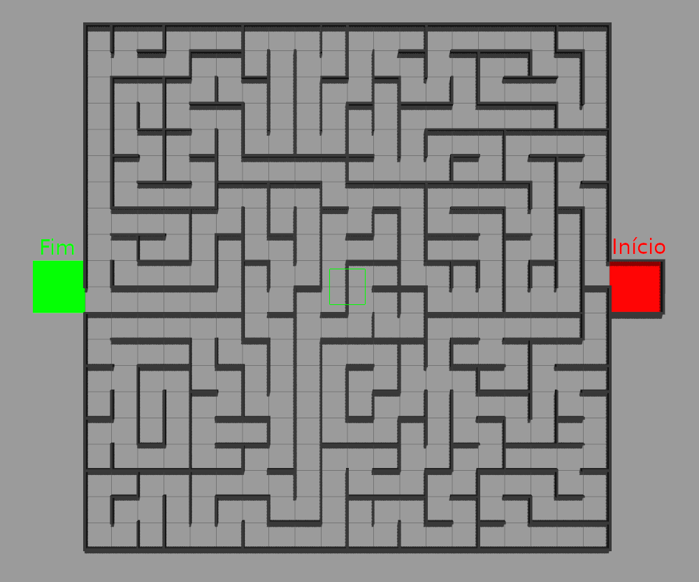
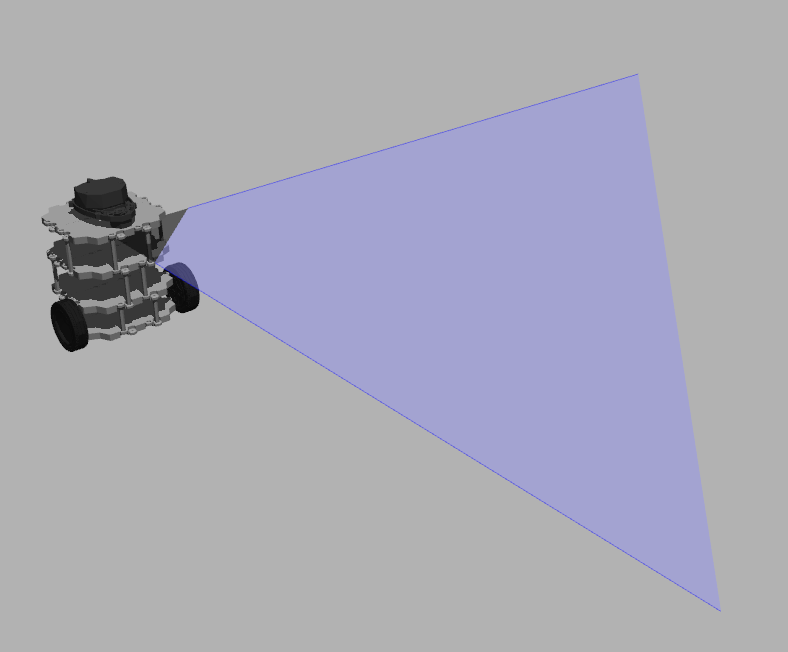
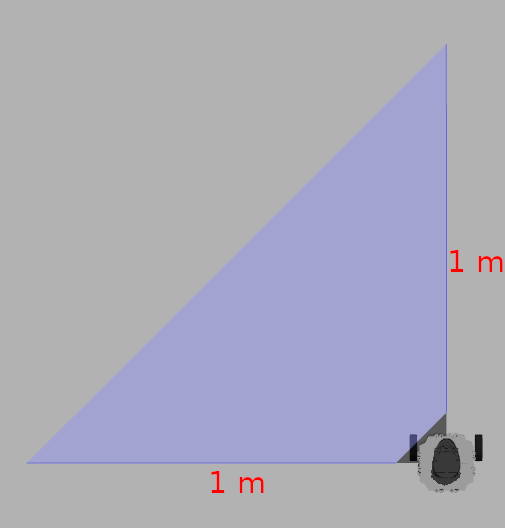
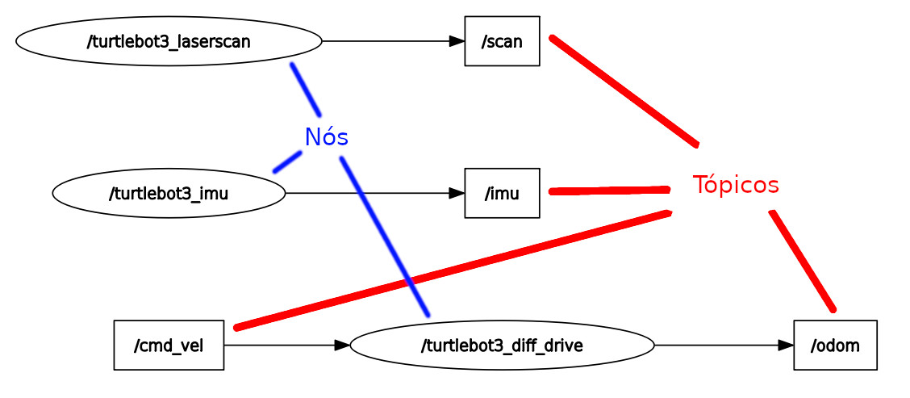

# Desafio OxeBots

Este pacote contém todos os recursos necessários para executar o ambiente de simulação do desafio de computação da OxeBots. Ele fornece o mundo simulado, contendo o robô Turtlebot3 e scripts de inicialização para você testar e desenvolver sua solução.

## Índice

- [Desafio OxeBots](#desafio-oxebots)
  - [Índice](#índice)
  - [Objetivo do desafio](#objetivo-do-desafio)
  - [Pré-requisitos](#pré-requisitos)
  - [Instalação](#instalação)
  - [Estrutura do pacote](#estrutura-do-pacote)
  - [Executando o ambiente de simulação](#executando-o-ambiente-de-simulação)
    - [Parâmetros opcionais](#parâmetros-opcionais)
  - [Interagindo com o robô](#interagindo-com-o-robô)
    - [Controlando o Robô](#controlando-o-robô)
    - [Visualizando dados dos sensores](#visualizando-dados-dos-sensores)
  - [Desenvolvendo sua solução](#desenvolvendo-sua-solução)
  - [Como a solução será avaliada](#como-a-solução-será-avaliada)

## Objetivo do desafio

O desafio de computação da OxeBots consiste em desenvolver uma solução de navegação autônoma para o robô TurtleBot3 em um ambiente simulado. O robô deve navegar por um labirinto para encontrar a saída.



O robô que deve ser utilizado é o TurtleBot3, sendo um robô móvel de código aberto amplamente utilizado em robótica educacional e de pesquisa.



Ele stá equipado com um sensor de distância a laser (LIDAR) na parte frontal e na parte esquerda do robô e um sensor de inércia (IMU) que mede a aceleração e orientação do robô. Além disso, o robô possui um sensor de odometria que mede a posição e orientação do robô.



Você pode usar qualquer abordagem para desenvolver sua solução. O objetivo é navegar com sucesso pelo labirinto e encontrar a saída.

## Pré-requisitos

Antes de prosseguir, certifique-se de que você atendeu a todos os pré-requisitos mencionados no [README principal do workspace](https://github.com/OxeBots/desafio_ws#pré-requisitos):

- **Sistema Operacional**: Ubuntu 22.04 (recomendado)
- **ROS2**: Humble
- **Gazebo**: Versão 11
- **Git**: Para clonar os repositórios

## Instalação

O pacote `desafio_oxebots` já está incluído no workspace do desafio. Se você clonou o workspace usando o comando `--recurse-submodule`, não é necessário fazer nenhuma instalação adicional.

Caso contrário, você pode clonar o pacote manualmente:

```bash
cd ~/desafio_ws/src
git clone https://github.com/OxeBots/desafio_oxebots.git
```

Depois, volte para a raiz do workspace e compile o workspace:

```bash
cd ..
. build.sh
```

## Estrutura do pacote

```bash
desafio_oxebots
├── launch/                 # Arquivos de inicialização do ROS2
│   └── desafio.launch.py   # Inicia o ambiente de simulação
├── models                  # Modelos do robô e labirinto
├── worlds/                 # Ambiente de simulação do Gazebo
├── urdf/                   # Descrições URDF do robô
├── CMakeLists.txt          # Arquivo de configuração de compilação
├── package.xml             # Metadados do pacote ROS2
└── README.md               # Este arquivo
```

## Executando o ambiente de simulação

Para iniciar o ambiente de simulação do desafio, execute:

```bash
ros2 launch desafio_oxebots desafio.launch.py
```

Este comando irá:

- Iniciar o Gazebo com o mundo do desafio (labirinto).
- Carregar o modelo do robô no ambiente.

### Parâmetros opcionais

Você pode personalizar a inicialização usando os parâmetros opcionais:

- **`x_pose`**: define a posição inicial x do TurtleBot3. Padrão: `0.0`.

    ```bash
    ros2 launch desafio_oxebots desafio.launch.py x_pose:=1.0
    ```

- **`y_pose`**: define a posição inicial y do TurtleBot3. Padrão: `-11.0`

    ```bash
    ros2 launch desafio_oxebots desafio.launch.py y_pose:=-10.0
    ```

- **`maze_model`**: escolhe o modelo de labirinto a ser carregado. Opções: `model-1`, `model-2`, `model-3`.

    ```bash
    ros2 launch desafio_oxebots desafio.launch.py maze_model:=model-2
    ```

## Interagindo com o robô

Após iniciar a simulação, você pode interagir com o robô usando a ‘interface’ do ROS2. Você pode controlar o robô, visualizar dados dos sensores e desenvolver sua solução.



### Controlando o Robô

Publique comandos de velocidade linear e angular no tópico `/cmd_vel`:

```bash
ros2 topic pub /cmd_vel geometry_msgs/msg/Twist "{linear: {x: 0.5, y: 0.0, z: 0.0}, angular: {x: 0.0, y: 0.0, z: 0.1}}"
```

### Visualizando dados dos sensores

Tópicos disponíveis:

- `/imu`
- `/odom`
- `/scan`

Se inscreva em algum desses tópicos para receber os dados que estão sendo publicados. Por exemplo, para visualizar os dados do sensor de distância:

```bash
ros2 topic echo /scan
```

## Desenvolvendo sua solução

Para desenvolver sua solução:

1. **Crie um pacote** dentro do workspace, conforme instruções no [README principal](https://github.com/OxeBots/desafio_ws#compilando-o-workspace).

   ```bash
   cd ~/desafio_ws/src
   ros2 pkg create sua_solucao
   ```

   > **IMPORTANTE**: identifique sua solução com o nome da sua equipe ou participante para evitar conflitos com outros pacotes.

2. **Implemente seus nós** que interagem com o ambiente do desafio.

3. **Compile o workspace** para incluir seu pacote:

   ```bash
   cd ~/desafio_ws
   . build.sh
   ```

4. **Teste sua solução** executando seus nós em conjunto com o ambiente de simulação.

**Nota:** Este pacote é parte integrante do desafio de computação da OxeBots. Certifique-se de ler todas as instruções cuidadosamente e seguir as diretrizes ao desenvolver sua solução.

## Como a solução será avaliada

A solução será avaliada com base nos seguintes critérios:

- **Navegação**: O robô consegue navegar pelo labirinto e encontrar a saída?
- **Eficiência**: A solução é eficiente em tempo e recursos?
- **Robustez**: A solução é robusta e lida bem com diferentes labirintos? Lembre-se que o labirinto pode tomar diferentes formas, porém sempre terá uma saída e o tamanho de 20 m x 20 m.
- **Qualidade do Código**: O código é bem organizado, documentado e segue boas práticas de programação?
- **Inovação**: A solução apresenta alguma inovação ou abordagem criativa?
- **Apresentação**: A solução é apresentada de forma clara e objetiva?
- **Colaboração**: A solução foi desenvolvida em equipe? Se sim, como foi a colaboração entre os membros?

Divirta-se! 🤖🚀
